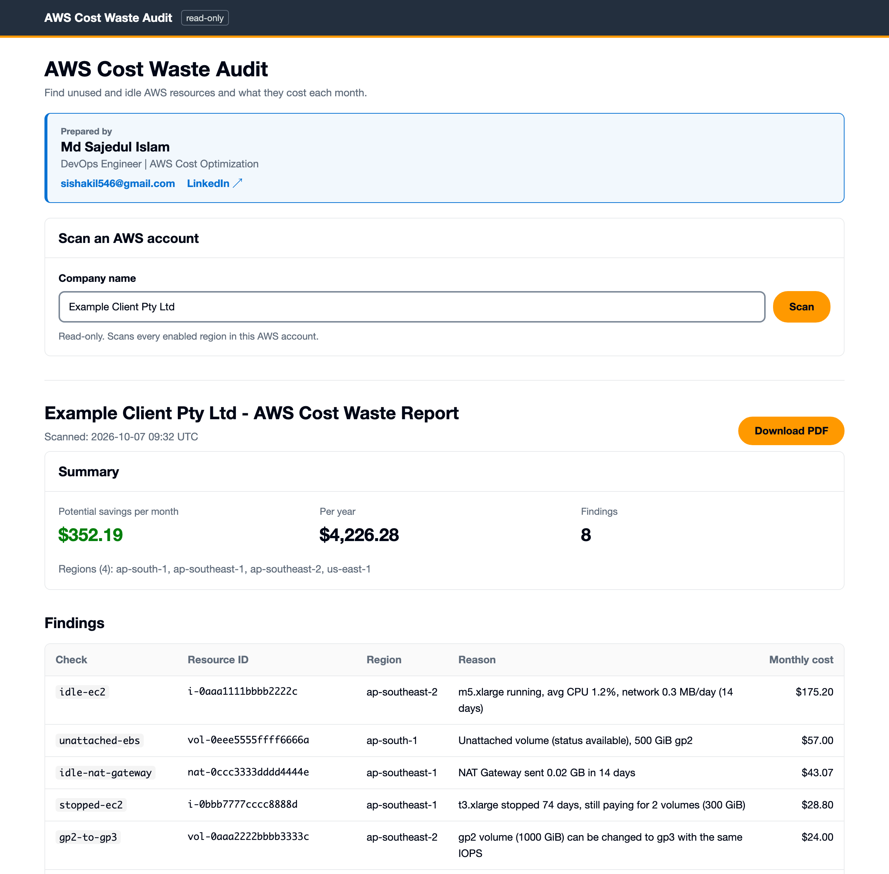
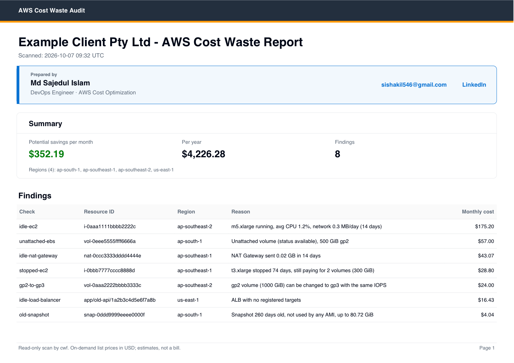
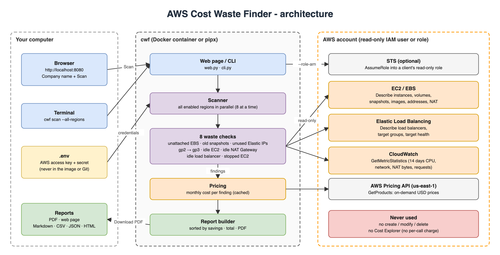

# AWS Cost Waste Finder

[](https://github.com/sajedul5/aws-cost-waste-finder/actions/workflows/ci.yml)
[](https://hub.docker.com/r/sajedul5/aws-cost-waste-finder)

**Find the AWS resources you pay for but don't use, and see how much money you can save each month.**

A free, open-source tool. You give it a **read-only** AWS key, click **Scan**, and in about a minute you get
a clear report like *"You can save about $352/month"*, listing every wasted resource with its cost.
Download it as a **PDF** and share it with your team or your client.



---

## Why it matters

Most AWS accounts pay for things nobody uses any more: a disk left behind after a server was
deleted, an old backup, a test server that was never stopped. Each one is small, but together they
often add up to **5% or more of the bill**, every month. AWS doesn't warn you about them.

| Who | What they get |
|---|---|
| **CEO** | A one-page answer to *"are we wasting money on AWS?"* — in dollars per month and per year. |
| **CFO** | Concrete savings with the cost of each item. No new subscription: the tool is free and calling it costs nothing. |
| **CTO** | Safe to run: read-only access, nothing is changed or deleted, nothing is installed in the AWS account, no data leaves your machine. |
| **DevOps / Cloud engineer** | The exact resource IDs, regions and reasons, sorted by savings, so you know what to fix first. Runs in Docker or from the command line. |

**Vision:** anyone with an AWS account should be able to see their wasted spend in minutes, for
free, without giving a vendor admin access to their account.

## What it finds

| Check | What it finds | Typical saving |
|---|---|---|
| `unattached-ebs` | Disks not attached to any server | The full disk price (e.g. 500 GiB gp2 ≈ $57/month) |
| `old-snapshot` | Backups older than 90 days that no server image uses | $0.05 per GB per month |
| `unattached-eip` | Public IP addresses not in use | $3.65/month each |
| `gp2-to-gp3` | Disks on the older gp2 type | About 20% of the disk price, no downtime |
| `idle-ec2` | Servers running but doing nothing (CPU < 5%, almost no network, 14 days) | The full server price |
| `idle-nat-gateway` | NAT Gateways with almost no traffic | About $33–43/month each |
| `idle-load-balancer` | Load balancers with no targets or almost no requests | About $16–20/month each |
| `stopped-ec2` | Servers stopped for more than 30 days that still pay for their disks | The disk price |

Every region enabled in the account is scanned. Prices come from the AWS Pricing API for each region.
All thresholds (14 days, 5% CPU, 90 days…) can be changed.

## Sample report (PDF)



Open the full sample: [examples/sample-report.pdf](examples/sample-report.pdf) ·
Markdown version: [examples/sample-report.md](examples/sample-report.md) (fake resource IDs).

---

## Quick start (Docker, about 10 minutes)

You need [Docker](https://docs.docker.com/get-docker/) and access to the AWS account you want to scan.

### 1. Create a read-only IAM policy

In the AWS Console: **IAM → Policies → Create policy → JSON**. Paste the content of
[`iam/read-only-policy.json`](iam/read-only-policy.json), click **Next**, name it **`CwfReadOnly`**,
and **Create policy**.

It only allows `Describe*`/`Get*` calls and the Pricing API: the tool **cannot** change, delete or
read the contents of anything (no S3 files, no databases, no logs).

### 2. Create a user and an access key

1. **IAM → Users → Create user**, name **`cwf-readonly`**, *no* console access.
2. **Attach policies directly** → select **`CwfReadOnly`** → **Create user**.
3. Open the user → **Security credentials → Create access key** → *Command Line Interface (CLI)* →
   copy the **Access key ID** and **Secret access key** (the secret is shown only once).

> Never use root or admin keys. Delete the key when you no longer need it.

### 3. Create a `.env` file

Create a file named `.env` in an empty folder (no quotes, no spaces around `=`):

```sh
AWS_ACCESS_KEY_ID=AKIA................
AWS_SECRET_ACCESS_KEY=........................................
AWS_DEFAULT_REGION=ap-southeast-2

# Optional: your name on the reports ("Prepared by")
# CWF_PREPARED_BY=Your Name
# CWF_PREPARED_BY_TITLE=DevOps Engineer
# CWF_CONTACT_EMAIL=you@example.com
# CWF_LINKEDIN_URL=https://www.linkedin.com/in/your-profile/
```

Keep this file private. It stays on your computer; it is never put inside the Docker image.

### 4. Pull and run

```sh
docker pull sajedul5/aws-cost-waste-finder:latest
docker run --rm --env-file .env -p 127.0.0.1:8080:8080 sajedul5/aws-cost-waste-finder web --host 0.0.0.0
```

### 5. Scan

Open **http://localhost:8080**, type the company name, click **Scan**, wait about a minute, then
click **Download PDF**. Press `Ctrl+C` in the terminal to stop.

---

## Command line

The same tool works without the web page:

```sh
# report on screen (Markdown)
docker run --rm --env-file .env sajedul5/aws-cost-waste-finder scan --all-regions

# save a file: markdown, csv, json or html
docker run --rm --env-file .env -v "$PWD/reports:/reports" sajedul5/aws-cost-waste-finder \
  scan --all-regions --format csv --output /reports/waste.csv
```

Or install it with Python 3.11+ (no Docker):

```sh
pipx install git+https://github.com/sajedul5/aws-cost-waste-finder
cwf scan --region ap-southeast-2        # one region
cwf scan --all-regions --format html --output reports/scan.html
cwf web                                 # web page on http://localhost:8080
```

| Option | Default | Meaning |
|---|---|---|
| `--region` / `--all-regions` | your AWS default region | Which regions to scan |
| `--format` | `markdown` | `markdown`, `csv`, `json` or `html` |
| `--output FILE` | screen | Write the report to a file |
| `--lookback-days` | 14 | Days of CloudWatch history for the idle checks |
| `--cpu-threshold` | 5 | Idle server: average CPU % below this |
| `--network-threshold-mb` | 5 | Idle server: network MB per day below this |
| `--nat-threshold-gb` | 1 | Idle NAT Gateway: GB sent in the lookback below this |
| `--lb-requests-threshold` | 100 | Idle load balancer: requests in the lookback below this |
| `--snapshot-age-days` | 90 | Old snapshot: older than this |
| `--stopped-days` | 30 | Stopped server: stopped longer than this |
| `--role-arn`, `--external-id` | – | Scan another account through a read-only role (below) |

## Scanning a client's account (no shared keys)

Instead of sending you keys, the client can create a read-only **role** that only your AWS account
can use, with an external ID. You then run `--role-arn arn:aws:iam::<CLIENT-ID>:role/CwfReadOnly
--external-id <ID>`. Step-by-step: [docs/iam.md](docs/iam.md).

## Safe by design

- **Read-only.** Only `Describe*`, `Get*` and Pricing API calls. A test fails the build if the code
  ever calls AWS without the permission being in the read-only policy.
- **Free to run.** No Cost Explorer (it charges per call); Describe and Pricing calls are free.
- **Your keys stay with you.** Passed at run time from `.env`; never written to the image, the repo
  or the report. The web page only listens on your own computer (`127.0.0.1`).
- **No account IDs or ARNs** in the reports.

## How it works



1. The web page or command line starts a scan with your read-only credentials.
2. Every enabled region is scanned in parallel; each check asks AWS for its resources (and
   CloudWatch for 14 days of usage where needed).
3. Each finding gets a monthly cost from the AWS Pricing API.
4. The report is sorted by savings, with a total, and shown on the page or saved as PDF/CSV/JSON.

The diagram source is [`docs/architecture.drawio`](docs/architecture.drawio) (open it at
[diagrams.net](https://app.diagrams.net)). More detail: [docs/architecture.md](docs/architecture.md),
[docs/checks.md](docs/checks.md), [docs/decisions.md](docs/decisions.md).

## Good to know

- Costs are **on-demand list prices in USD**. Savings Plans, Reserved Instances and credits are not
  applied, so your real saving can differ.
- Snapshot savings are an upper bound ("up to"): snapshots are incremental.
- Data-transfer and request charges (NAT data, load balancer LCUs) are not counted, so real savings
  are often **higher**.
- The tool finds waste; it does not fix it. Check with the owner before deleting anything.
- AWS China and GovCloud are not supported.

## Development

```sh
python3 -m venv .venv && .venv/bin/pip install -e ".[dev]"
.venv/bin/ruff check . && .venv/bin/ruff format --check .
.venv/bin/pytest            # uses moto (fake AWS): never touches a real account
docker build -t cwf .
```

Project layout: `src/cost_waste_finder/` (code, one file per check in `checks/`), `tests/`,
`iam/` (policies), `docs/`, `examples/`, `scripts/` (diagram and sample generators).

---

Built by **Md Sajedul Islam**, DevOps Engineer ·
[LinkedIn](https://www.linkedin.com/in/sajedul-islam-devops/)

*This is an independent open-source project, not an official AWS product.*
